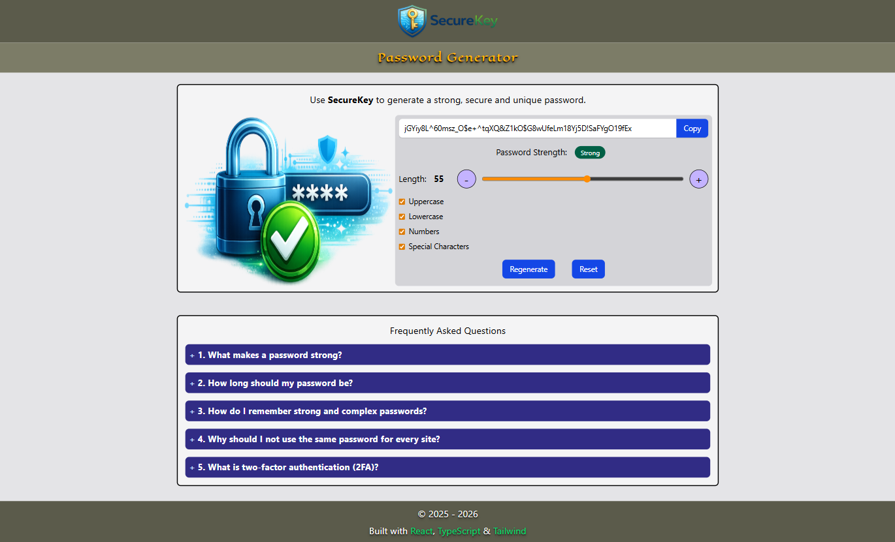
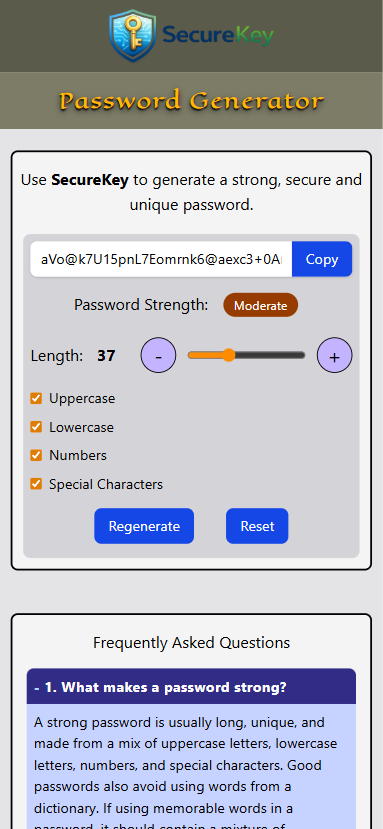
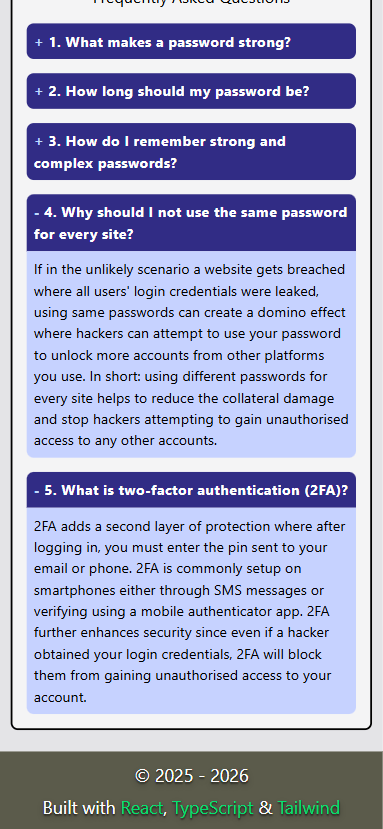
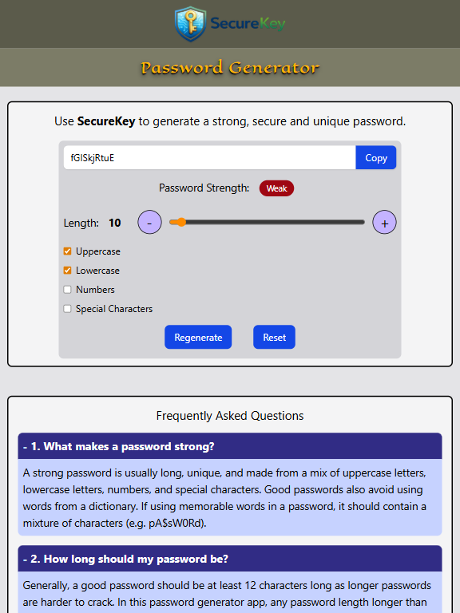
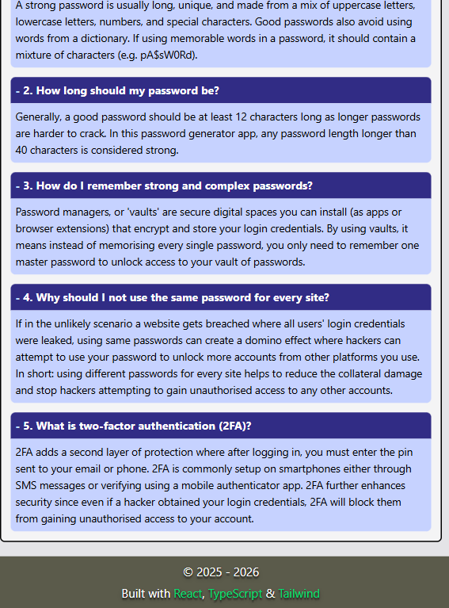

 <!-- banner height: 150px, width: 1000px -->

**SecureKey** is a password generator app to help users create strong, secure and unique passwords. The app provides a simple UI for generating passwords based on selected criteria such as length, uppercase/lowercase letters, numbers and special characters. It features a responsive layout and includes a helpful FAQ content, explaining good password practices and cyber security concepts such as two-factor authentication and how to manage complex passwords.

## Setup Instructions
#### 1. Clone the Repository:
Enter the following in the terminal or command line:

```bash
git clone https://github.com/vkumar-2/React-SecureKey.git
npm install
npm run dev
```
Note: `npm install` will install dependencies and only needs to be performed for first time installation.

#### 2. Access localhost URL:
After running `npm run dev`, Vite will output your local development URL in the terminal (e.g. http://localhost:5173 ). Enter the provided localhost link into your web browser address bar to begin running the app.

## Frameworks
### React + Vite
The project uses React for building the UI/UX and Vite as the development/build tool. Vite provides fast startup times, hot module replacement, and an efficient build process.

### TypeScript
The codebase uses TypeScript to add static typing to components, props, functions, and state. This helps improve code reliability, readability, and maintainability.

### Tailwind CSS
The project uses Tailwind CSS for styling. Utility classes are applied directly in components to build a responsive and modern interface without writing large separate CSS files.

## Images
| Desktop 1 |
| ------------ |
|  |

| Smartphone 1 | Smartphone 2 |
| ------------ | ------------ |
|  |  |

| Tablet 1 | Tablet 2 |
| ------------ | ------------ |
|  |  |
